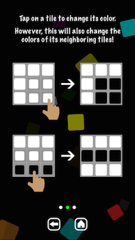

# Neighbor_Tiles
A puzzle game for iOS devices.

# Screenshots

# Instructions

You are given a grid of tiles.
Each tile can be one of two possible colors.
Tapping on a tile changes its color.

However, all neighboring tiles will also change colors!
Your goal is to make all the tiles black!

# License

(c) 2014 Varan Sharma. Released under the terms of the MIT license.

